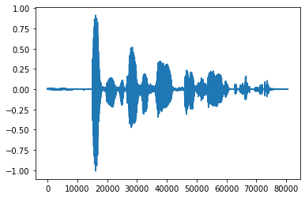
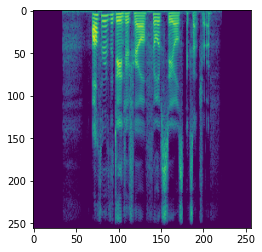
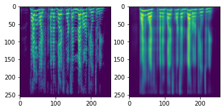
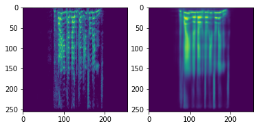
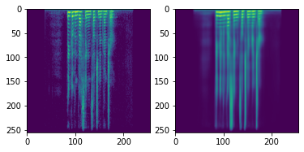
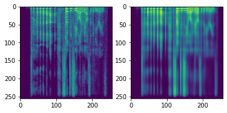

# Sound-generation-using-VAE
Pytorch implementation of Emotions generation with VAE using EmoV-DB.

- The idea behind this project is to build a machine learning model that could generate more samples of voiced emotions.
- Using the pre-trained model you could use both the latent vector of your voice for classification and for generation a new sample which sounds similar to your voice by using the reparametrization trick. 

**Dataset:**
[EmoV-DB](https://github.com/numediart/EmoV-DB)

### Audio files:

**Waveform**

**Spectrogram**

## Data preperation
- Download EmoV-DB
- Run '!python 'emodb_preprocess.py' --frame_size 512 --hop_length 313 --duration 5'
This will split the data to 80% train and 20% test. The max length audio would be 5 second. 
You should see the creation of a spectrogram dir.

## Training a VAE Model
- Run model_training.py
This will save a model each epoch

* In order to get better reconstruction results:
- Use more data - i.e., augmentations, another dataset, etc.
- Play around the reconstruction_term_weight

## Sound generation using a pre-trained VAE Model
- Run generator.py
This script takes spectrograms from SPECTROGRAM_PATH and save audio signals in SAVE_DIR_GENERATED

## pre-trained models
[256X256 spectrogram model](https://drive.google.com/file/d/1B6yFE6gwGfqQrfuOapahrpdfNig4QQUj/view?usp=sharing)
Place it under 'saved_models_256'

## Reconstruction results

